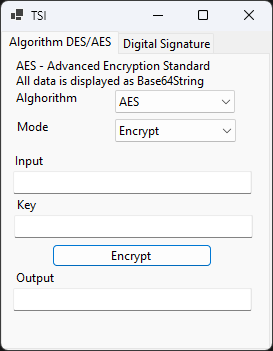

# TSIAlgorithms
## Encryption and Digital Signature Project

This project was developed as part of the Technologies of Information Security course at UTM. It implements symmetric and asymmetric encryption algorithms, as well as digital signature functionality. The project is built using C# WinForms for the user interface.

## Algorithms

The project includes the following algorithms:

- DES (Data Encryption Standard): Used for symmetric encryption and decryption.
- AES (Advanced Encryption Standard): Used for symmetric encryption and decryption.
- RSA (Rivest-Shamir-Adleman): Used for digital signature generation and verification.

## User Interface

The project utilizes C# WinForms for the graphical user interface (GUI), providing an intuitive way to interact with the implemented algorithms. The interface allows users to input the necessary data, choose the desired algorithm, and perform encryption, decryption, and digital signature operations.

## Screenshots

  
  

## Usage

To use this project, follow these steps:

1. Clone the repository to your local machine.
2. Open the solution in Visual Studio.
3. Build the solution to compile the project.
4. Run the application.

## Acknowledgments

- The Technologies of Information Security course at UTM for providing the inspiration and guidance for this project.